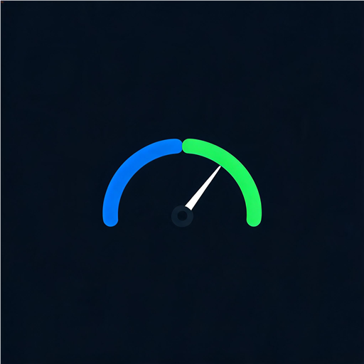

# GameMonitor

> 轻量级游戏性能实时监控 · 副屏常驻 · 零外部依赖 · C# 原生 WinForms

<p align="center">
  
</p>

GameMonitor 是一款面向 PC 玩家的实时性能监控工具，专为**副屏竖屏常驻**设计。通过 NVML 直连 GPU、Windows 内核 API 采集 CPU/内存、可选 LibreHardwareMonitor 读取主板传感器，以极低资源占用提供游戏场景下的关键性能指标与降频事件追踪。


---

## 核心特性

### 实时监控

| 指标 | 数据来源 | 说明 |
|------|---------|------|
| **GPU 负载/温度/频率/功耗/显存/风扇/带宽** | NVML 直连 | 微秒级 P/Invoke `nvml.dll`，无进程开销 |
| **CPU 负载/频率/温度/功耗** | GetSystemTimes + WMI 性能计数器 + 可选 LHM | 真实频率 = 基频 × `% Processor Performance` |
| **内存占用 + Top10 进程** | GlobalMemoryStatusEx + WorkingSet64 | FLIP 式平滑动效，PID 标识防同名进程错乱 |
| **每核负载** | NtQuerySystemInformation | 8 物理核柱状图，SMT 线程 max 聚合 |

### 游戏场景增强

- **游戏自动识别**：进程名匹配库（魔兽世界/CS2/原神/黑神话等 25+ 款），自动检测启动/切换/退出并记录时长
- **降频事件追踪**：实时解析 NVML Throttle Reasons，区分功耗墙/温控/硬件降速，推送托盘通知
- **帧率骤降检测**：30 秒内从 ≥50 帧跌至 <30 帧时自动记录事件（ETW 采集，开发中）
- **性能报告导出**：一键导出 CSV（UTF-8 BOM，Excel 直接打开），含完整历史样本 + 峰值汇总 + 事件记录

### 交互体验

- **副屏全屏常驻**：双击标题栏切换全屏，窗口位置/大小自动记忆
- **8 方向自由缩放**：窗口四周均可拖拽缩放
- **点击穿透**：托盘菜单切换，不影响游戏操作
- **时间范围切换**：负载曲线 1m / 2m / 5m / 10m 可调
- **事件详情弹窗**：点击事件卡查看完整历史，弹窗向上展开避免遮挡

### 视觉设计

- **深色主题**：低亮度卡片 + 边缘光效，游戏时不抢眼
- **动态光效**：卡片边框随负载从绿→红过渡
- **平滑动画**：核心负载/进程排名/数值变化均采用 80ms 插值动画
- **自适应缩放**：内容驱动布局引擎，MeasureString 实测行高，永不裁切

---

## 截图

<!-- 截图占位 -->
```
┌─────────────────────────────────┐
│  ● 游戏性能监控     ─ □ ✕       │
├─────────────────────────────────┤
│  GPU  RTX 3070          P0      │
│  27%               52°C 630MHz │
│                   37/220W 5.8GB │
│                   风扇 64% 7%   │
│  ╱╱╱╱ GPU 温度曲线 ╱╱╱╱╱╱╱╱╱╱  │
├─────────────────────────────────┤
│  CPU  Ryzen 7 5800X3D  LHM      │
│  23%            N/A  3351 MHz   │
│              封装功耗 峰值频率  │
│  ▁▃▅▇▆▄▂▁  8 核柱状图          │
├─────────────────────────────────┤
│  内存  32 GB DDR4 3200 MT/s     │
│  39%      12.7/32 GB            │
│  内存占用 Top 10                │
│  ▰▰▰▰▱▱▱▱  TeleAgent    643 MB │
│  ▰▰▰▱▱▱▱▱  Download...  439 MB │
│  ▰▰▱▱▱▱▱▱  explorer     375 MB │
│  ...                           │
├─────────────────────────────────┤
│  负载曲线  1m 2m 5m 10m         │
│  ─ GPU 27%  ─ CPU 23%  ─ 内存 39%│
│  ╱╱╱╱╱╱╱╱╱╱╱╱╱╱╱╱╱╱╱╱╱╱╱╱╱╱  │
├─────────────────────────────────┤
│  ⚠ 事件记录       点击查看详情  │
├─────────────────────────────────┤
│  CPU 0.5%  内存 79MB   会话 0:09│
└─────────────────────────────────┘
```

---

## 快速开始

### 运行（无需编译）

1. 下载 [Latest Release](https://github.com/suncry/GameMonitor/releases)
2. 解压到任意目录
3. 双击 `GameMonitor.exe`（自动提权，不弹 UAC）
4. 程序自动定位到副屏，开始监控

> **系统要求**：Windows 11+、NVIDIA GPU（NVML）、管理员权限（ETW + 内核传感器）

### 编译

```bash
# 需要 .NET Framework 4.5+ (Windows 自带) 和 .NET Framework C# 编译器
C:\Windows\Microsoft.NET\Framework64\v4.0.30319\csc.exe ^
  /target:winexe /platform:x64 /optimize+ ^
  /win32manifest:src\app.manifest ^
  /win32icon:src\app.ico ^
  /out:GameMonitor.exe ^
  /r:System.dll /r:System.Core.dll /r:System.Drawing.dll ^
  /r:System.Windows.Forms.dll /r:System.Management.dll ^
  src\Collector.cs src\MonitorForm.cs src\Nvml.cs ^
  src\Lhm.cs src\Native.cs src\Program.cs
```

将编译产物与 `runtime/` 目录中的 DLL 放在同一目录即可运行。

---

## 项目结构

```
GameMonitor/
├── assets/                      # 项目资源
│   ├── logo.png                 # 项目 Logo
│   └── icon.ico                 # 多尺寸图标 (256/128/64/48/32/16)
├── src/                        # 源码
│   ├── Program.cs               # 入口 (DPI 感知 + 应用启动)
│   ├── MonitorForm.cs           # 主界面 (布局引擎 + 绘制 + 交互 + Snap Layout)
│   ├── Collector.cs             # 统一采样器 (每秒一次, 组合多源)
│   ├── Nvml.cs                  # NVIDIA NVML 直连 (P/Invoke)
│   ├── Lhm.cs                   # LibreHardwareMonitor 反射加载 (可选)
│   ├── EtwFps.cs                # ETW 帧率追踪 (开发中)
│   ├── Native.cs                # Win32 API 封装
│   ├── app.ico                  # 编译用图标 (/win32icon)
│   └── app.manifest             # 提权 + DPI 声明
├── runtime/                    # 运行时依赖
│   ├── GameMonitor.exe          # 编译产物
│   ├── GameMonitor.exe.config   # 程序集重定向
│   ├── LibreHardwareMonitorLib.dll  # 可选: CPU 温度/风扇
│   └── System.*.dll             # LHM 依赖
└── README.md
```

---

## 技术架构

### 数据采集层

```
┌──────────────────────────────────────────┐
│              Collector (1Hz)             │
├──────────┬──────────┬──────────┬──────────┤
│  NVML    │  Win32   │   WMI    │   LHM    │
│  (GPU)   │ (CPU/内存)│(CPU频率) │(温度/风扇)│
│ P/Invoke │ 内核API  │性能计数器 │ 反射加载 │
│ 微秒级   │ 零开销   │ 用户态   │  可选    │
└──────────┴──────────┴──────────┴──────────┘
```

- **NVML 直连**：直接 P/Invoke `nvml.dll`，避免 NVAPI 包装层开销，微秒级响应
- **CPU 真实频率**：`% Processor Performance × 基频`，用户态 WMI 通道，不依赖被 HVCI 拦截的内核传感器驱动
- **LHM 反射加载**：运行时反射加载 `LibreHardwareMonitorLib.dll`，无编译期依赖，DLL 不存在时自动降级

### 布局引擎

- **内容驱动堆叠**：MeasureString 实测每行高度 → 逐卡片堆叠 → 自适应缩放因子 `_sf`
- **永不裁切**：4 轮迭代缩放，overflow > 0 时自动缩小，下限 0.55
- **全尺寸适配**：从 340×780 紧凑模式到 1440×2560 副屏全屏，所有元素按比例缩放

### 动画系统

- **80ms 定时器**：核心负载、CPU 总负载、进程排名/数值均采用 0.28 系数指数趋近
- **FLIP 式进程动画**：新进程从底部滑入、排名变化时交叉滑动、跌出时滑出消失
- **PID 标识**：同名多进程（多个 chrome）按 PID 区分，不合并错乱

---

## 已知限制

| 限制 | 原因 | 解决方案 |
|------|------|---------|
| **CPU 温度 N/A** | LHM 不支持 5800X3D PM 表；WinRing0 驱动非 WHQL 签名被 Win11 内核拒绝 | `bcdedit /set testsigning on` + 重启 |
| **CPU 风扇 N/A** | 同上，LHM 主板 SuperIO 驱动受限 | 同上 |
| **帧率追踪开发中** | Win11 的 Present 事件需多 Provider 关联（PresentMon 3000 行逻辑），实时消费受限 | 后续版本支持 |

---

## 配置

配置文件位于 `%LOCALAPPDATA%\GameMonitor\config.txt`：

```ini
left=100        # 窗口 X 坐标
top=100         # 窗口 Y 坐标
w=540           # 窗口宽度
h=1440          # 窗口高度
through=0       # 点击穿透 (0=关闭, 1=开启)
range=120       # 负载曲线时间范围 (60/120/300/600 秒)
```

---

## 技术栈

- **语言**：C# 5（兼容 .NET Framework 4.5+，无 `string interpolation` / `null-conditional`）
- **UI**：WinForms + GDI+ 手绘（无第三方 UI 库）
- **GPU**：NVML 12+ P/Invoke
- **传感器**：LibreHardwareMonitorLib 0.9.6（反射加载，可选）
- **编译**：csc.exe（Windows 自带，无需 Visual Studio）

---

## 版本历史

### v6.1
- **Logo / 应用图标**: 速度计造型 Logo, 多尺寸 ICO 嵌入 exe
- **Windows 11 Snap Layout**: 支持快速分屏 (Win+Z / 悬停最大化按钮 / 拖拽到边缘)
- **开始菜单**: 自动安装到 `%LOCALAPPDATA%\Programs\GameMonitor`, 开始菜单可搜索
- **任务栏可见**: 窗口显示在任务栏, 可与其他应用分屏共存
- **右键菜单**: 新增「切换全屏」选项

### v6.0
- 游戏自动识别（进程名匹配库 + 状态机）
- CPU 真实频率（WMI `% Processor Performance` × 基频）
- CSV 性能报告导出
- 标题栏按钮修复

### v5.0
- 内存 Top10 FLIP 式平滑动效（PID 标识防同名错乱）
- GPU 卡新增风扇 + 带宽指标
- CPU 卡风扇 RPM（LHM 主板传感器）

### v4.0
- 12 项 UI/UX 改造（卡片光效 / 时间范围 / 全屏 / 8 方向缩放等）
- 事件弹窗 + 点击穿透

---

## License

MIT License - 详见 [LICENSE](LICENSE)

---

## 致谢

- [LibreHardwareMonitor](https://github.com/LibreHardwareMonitor/LibreHardwareMonitor) - 开源硬件监控库
- [NVIDIA NVML](https://docs.nvidia.com/deploy/nvml/) - GPU 管理库
- [PresentMon](https://github.com/GameTechDev/PresentMon) - 帧率追踪参考实现
